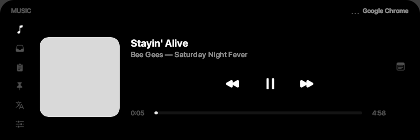
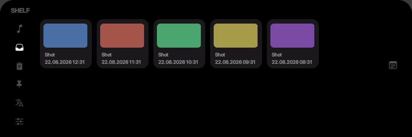
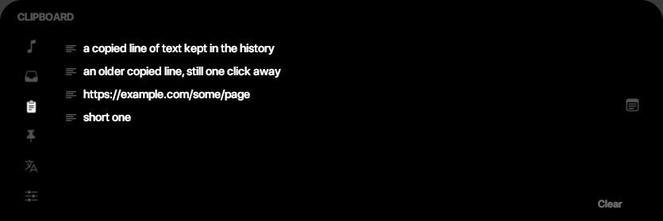
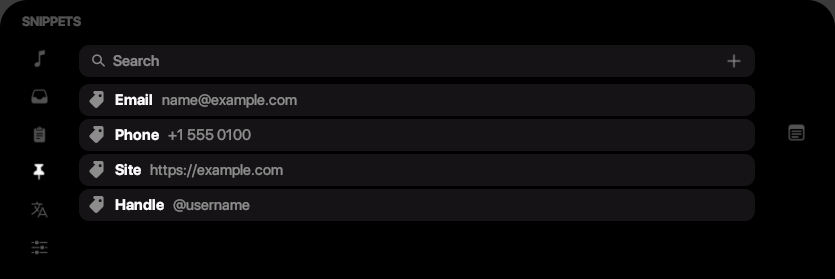
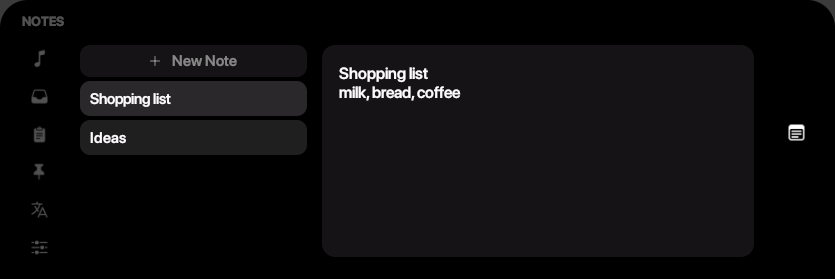
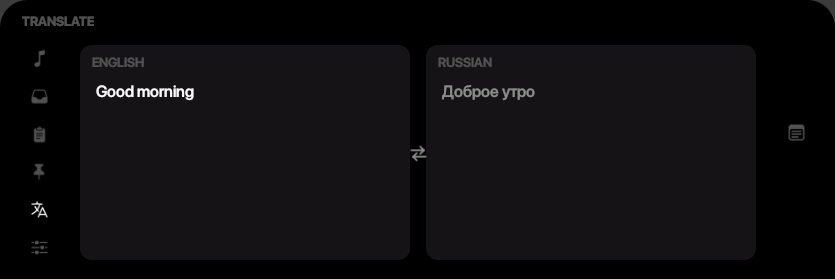
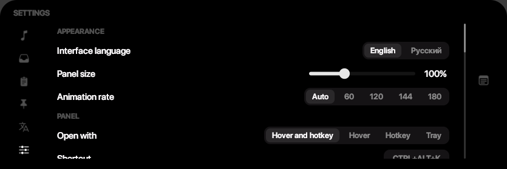
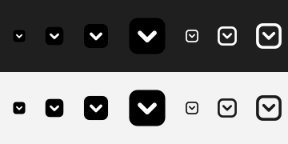

# Knack

**English** · [Русский](README.ru.md)

A sliding panel for Windows. Move the pointer to the edge of the screen and a
strip slides out with your music, a shelf of screenshots, clipboard history,
snippets, notes and a translator. Move away and it slides back.



The idea and layout are inspired by
[cyclop](https://github.com/akalikbergenov/cyclop) — there the panel hides in the
MacBook notch, here it slides out of whichever screen edge is free.

## Install

Needs Python 3.13 and Windows 10 or 11.

```bash
pip install -r requirements.txt
```

```bash
python main.py
```

Knack lives in the tray. Its icon follows the Windows theme: light on a dark
taskbar, dark on a light one.

## Opening the panel

| Way | How |
|---|---|
| Hover | Hold the pointer at the free screen edge for 150 ms |
| Hotkey | `Ctrl+Alt+K` |
| Tray | Click the icon |

The panel slides out of the edge opposite the taskbar: taskbar at the bottom,
panel at the top, and the other way round. It appears on the monitor the pointer
is on.

## Tabs

### Music

Cover art, title, artist, transport buttons and a seek bar. Data comes from the
Windows Media Session, so it works with anything that plays sound: browsers,
Spotify, media players. With several sources active, clicking the source name in
the top right switches between them.

Not every source accepts seeking. Those that do not advertise it get the bar as a
plain indicator that ignores clicks.

### Shelf



Screenshots you copy land here on their own, and files can be dropped in with the
mouse. A click puts the picture on the clipboard, the cross removes the card. A
card can be dragged back out — into a folder, a chat, any window that takes
files. For music and video the clipboard gets the file path, which is what chats
paste with `Ctrl+V`.

Files live in `%APPDATA%\Knack\clipboard` and survive restarts. Delete a file
outside the app and its card disappears by itself.

Video cards show a frame, music cards show the embedded cover art. That needs
ffmpeg: it is downloaded once into `%APPDATA%\Knack\tools` when such a file first
reaches the shelf. Not wanted — switch it off in settings.

### Clipboard



History of copied text, newest first. A click puts the line back on the
clipboard, the cross drops one entry, "Clear" drops all of them. A hundred
entries are kept by default. Files copied in Explorer are not stored here: they
are not text.

### Snippets



Email, phone, links — whatever you are tired of typing. A click copies the value.
Search matches both the name and the content. The plus on the right turns the bar
into an add row: name on the left, value on the right, `Enter` saves, `Esc`
cancels.

The file `%APPDATA%\Knack\snippets.json` can also be edited by hand.

### Notes



List on the left, text on the right. The first line of a note becomes its title.
Empty notes are cleaned up when you leave the tab.

### Translator



Two panes, each with its own language — click the label to pick one. The button
between them swaps the panes together with the text already translated. The
direction follows what you type: type Cyrillic into the pane set to English and
the panes swap themselves.

The engine is chosen in settings:

- **Offline** — [Argos Translate](https://github.com/argosopentech/argos-translate),
  shipped with the app and works without a connection. Language models are
  downloaded the first time you use a pair, around 200 MB; you can pick the
  folder for them.
- **DeepL** — with an API key, pasted in settings.

The engine starts loading as soon as you open the tab, so it is ready by the time
you finish typing.

### Settings



| Section | What it covers |
|---|---|
| Appearance | Interface language, panel size, animation rate |
| Panel | What opens and hides it, delays, shortcut, monitor, edge gap |
| Shelf | Previews for video and music |
| Clipboard | History length |
| Translator | Engine, DeepL key, models folder, language detection |
| Character replace | On or off, shortcut, clipboard restore |
| System | Start with Windows |
| Tools | Update check, ffmpeg install |

Everything applies immediately; there is no Save button.

## Character replace

Typed "Ghbdtn" when you meant "Привет"? Select the text and press `Ctrl+Alt+L` —
the characters are rewritten as if the layout had been right. The direction is
worked out from the text itself.

The table is built from the keyboard layouts installed in your system rather than
hard-coded, so it works with whatever pair you have.

It will not work in windows running as administrator: synthetic input from an
ordinary program does not reach them. Punto Switcher has the same limitation.

## Shortcuts

| Keys | Action |
|---|---|
| `Ctrl+Alt+K` | Show or hide the panel |
| `Ctrl+Alt+L` | Switch the layout of the selected text |

Both can be changed in settings: click the field and press the new combination.

## Updates

"Check for updates" in the tray menu looks at the GitHub releases. If a newer
version is out, the app downloads the zip, replaces its own exe and restarts. It
only works in the built app: there is nothing to replace when running from
source.

## Where the data lives

Everything sits in `%APPDATA%\Knack`:

| File | What is inside |
|---|---|
| `config.json` | Settings |
| `clipboard_history.json` | Clipboard history |
| `shelf.json`, `clipboard/` | The shelf and its files |
| `snippets.json` | Snippets |
| `notes.json` | Notes |
| `translate/` | Translator language models |
| `tools/` | ffmpeg for video previews |
| `knack.log` | Log |

Knack reaches the network in four cases: an update on GitHub, translator language
models, ffmpeg for previews, and DeepL if you entered a key yourself. Nothing
else is sent anywhere.

## Not there yet

- A calendar with the next meeting — cyclop has one.
- Themes beyond the dark one. Colours are kept as roles, so a new theme is one
  object in `knack/ui/theme.py`.

## Under the hood

The panel never takes focus from the active program, so it does not interrupt
typing; focus is taken only on tabs with input fields.

Animations run at the refresh rate of the monitor rather than a fixed 60 frames —
the difference shows at 180 Hz. The rate can be pinned to 60 in settings.

The layout is drawn for 2560x1440; other resolutions are scaled from the screen
height: 1080p gives a 718x240 panel, 1440p 835x279, 4K 1070x358. A size slider
works on top of that.

The clipboard is watched through a system event, not polling. While the panel is
closed, not a single timer is running.

## Building

```bash
pyinstaller --clean --noconfirm Knack.spec
```

The resulting `dist\Knack.exe` carries the icon and a version resource taken from
`knack/core/constants.py`, so bumping the version means editing one line there.

The installer is built with Inno Setup 6:

```bash
iscc knack_setup.iss
```

It installs into the folder of the current user without administrator rights,
offers a desktop shortcut and autostart, and asks on uninstall whether to keep
the shelf and notes.

The offline translator is part of the build. `argostranslate` itself drags in
spacy, stanza and torch — nearly 1.4 GB together, 1.2 GB of which is torch. None
of the three is used when translating with a ready model, so `Knack.spec`
excludes them and substitutes empty modules from `pyi_hooks/`. Sentence splitting
is pinned to minisbd.

## Icons



The app icon on the left, the monochrome tray one on the right, over a dark and a
light taskbar. Every size and colour is produced from a single SVG at runtime —
there are no per-size files.

## Credits

[cyclop](https://github.com/akalikbergenov/cyclop) — where the idea came from.
